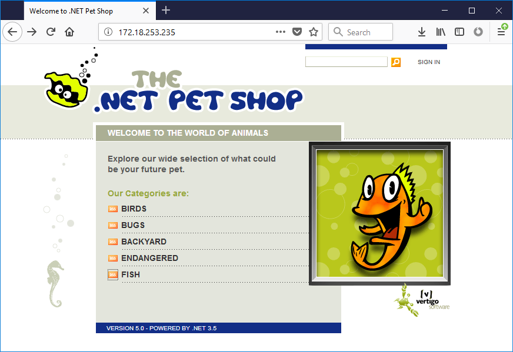

# .NET Pet Shop - Running in Docker

This is the `5.0` version of the Pet Shop, which was updated to .NET 3.5 in AD 2008.

In this repo there is a [Dockerfile for the web application](docker/web/Dockerfile) and a [Dockerfile for the SQL Server database](docker/db/Dockerfile). You can run this 10-year old app in Windows Docker containers.

> There's just one code change from the original 2008 version, which is to add an [alternative order processor](src/PetShop/BLL/OrderSynchronousWithoutTransactions.cs) that doesn't use transactions. This is only needed when you're running the database in a container, because SQL Server containers don't support MSDTC.

## Usage

You can compile and run the whole app in containers. You don't need SQL Server or .NET 3.5 installed, you just need [Docker Desktop](https://www.docker.com/products/docker-desktop) on Windows 10, or [Docker Enterprise](https://store.docker.com/editions/enterprise/docker-ee-server-windows) on Windows Server 2016.

Start by cloning this repo and switching to the directory:

```
git clone https://github.com/sixeyed/petshopvnext.git

cd petshopvnext
```

Then use [Docker Compose](https://docs.docker.com/compose/overview/) to build the app (you can skip this step and just use the public images on Docker Hub):

```
docker-compose `
  -f .\app\docker-compose.yml `
  -f .\app\docker-compose-build.yml `
  build
```

Then start the app with Compose:

```
docker-compose -f .\app\docker-compose.yml up -d
```

On Windows 10 you can browse to http://localhost:8010 to see the app.

On Windows Server 2016 you'll need to get the IP address of the container and browse to it:

```
docker container inspect --format '{{ .NetworkSettings.Networks.nat.IPAddress }}' app_petshop-web_1
```

And you'll see this:



Everything works, including the checkout function and the RSS feeds (which are running in a WCF service).


### Credits

Original source code from [petshopvnext on the CodePlex archive](https://archive.codeplex.com/?p=petshopvnext).